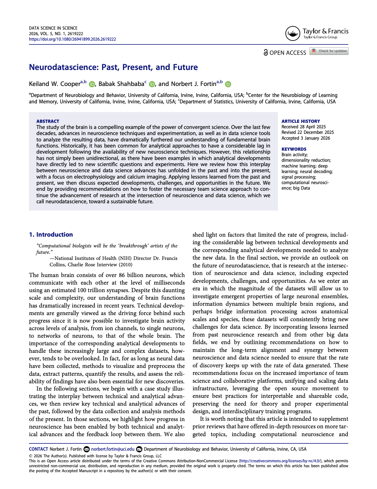

>  “Computational biologists will be the ‘breakthrough’ artists of the future.”
>
>  - NIH Director Dr. Francis Collins, Charlie Rose Interview (2010)

## In a nutshell:

The study of the brain is a compelling example of the power of convergent science. Over the last few decades, advances in neuroscience techniques and experimentation, as well as in data science tools to analyze the resulting data, have dramatically furthered our understanding of fundamental brain functions. Historically, it has been common for analytical approaches to have a considerable lag in development following the availability of new neuroscience techniques. 

However, this relationship has not simply been unidirectional as there have been examples in which analytical developments have directly led to new scientific questions and experiments. Here, we promote the advancement of research at the intersection of neuroscience and data science, which we call neurodatascience, towards a sustainable future.

## Explore the site:
 Click around some of the site pages for a glimpse of what we're building: 

* [A list of open source neuro-data repositories](./repositories.html){:target="_blank" rel="noopener noreferrer"}
* [A working list of neuroscience data analysis packages](./packages.html){:target="_blank" rel="noopener noreferrer"}
* [A list of standardized data formats](./formats.html){:target="_blank" rel="noopener noreferrer"}

## Read the paper:

Read the paper: _Neurodatascience: Past, Present, and Future_ by Keiland W. Cooper, Babak Shahbaba, and Norbert J. Fortin, now out in _Data Science in Science_. 

[{: style="display: block; margin: auto; width: 30%;" } ](https://doi.org/10.1080/26941899.2026.2619222){:target="_blank" rel="noopener noreferrer"}

This scoping review highlights how the interplay between neuroscience and data science advances has unfolded in the past and into the present. Applying lessons learned from the past and present, the paper discusses expected developments, challenges, and opportunities in the future. Recommendations are given on how to foster the necessary team science approach to continue the advancement of research at the intersection of neuroscience and data science, termed _neurodatascience_, toward a sustainable future.

[< Click here to view the paper! >](https://doi.org/10.1080/26941899.2026.2619222){:target="_blank" rel="noopener noreferrer"}

## Contribute!
Have an idea? Notice something we missed? Please feel free to [_contribute_](./contribute){:target="_blank" rel="noopener noreferrer"}.

<!-- https://github.com/neurodatascience-group/neurodatascience-group.github.io -->
<!-- https://github.com/neurodatascience-group/neurodatascience-group.github.io/issues -->

