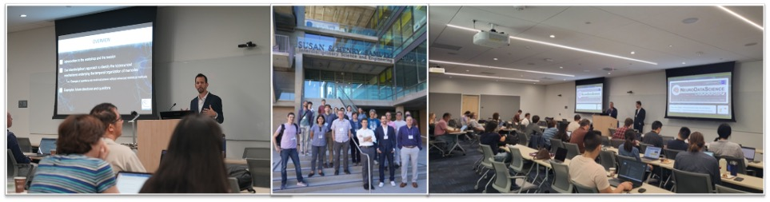

## The UCI Neurodatascience Group

{: style="display: block; margin: auto; width: 75%;" }

The UCI neurodatascience group is an interdisciplinary team of neuroscientists, data scientists, statisticians, and computer scientists who aim to develop advanced methods to measure and decode brain activity. Led by [Dr. Norbert Fortin](https://fortinlab.bio.uci.edu/){:target="_blank" rel="noopener noreferrer"} and [Dr. Babak Shahbaba](https://ics.uci.edu/~babaks/){:target="_blank" rel="noopener noreferrer"}, this growing team has produced work spanning a broad range of inquiry across the neuroscience and data science fields. 

&larr; [Home]({{ '/' }})

Last updated: 26 March, 2026
